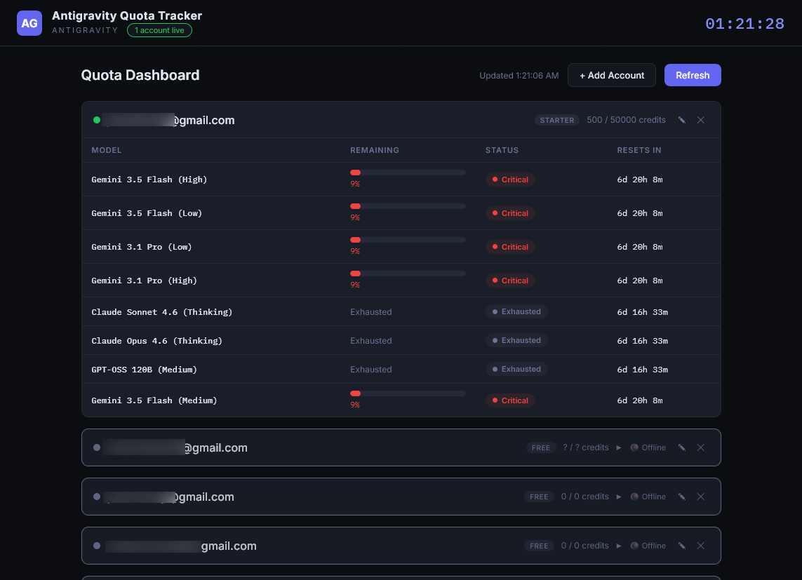

# Antigravity Quota & Usage Tracker

Real-time dashboard (web + Electron) that auto-discovers running Antigravity IDE language server processes and displays AI model quota usage across multiple accounts. No API keys required — it talks directly to the local language server.




## How it works

The app scans for running Antigravity language server processes via WMI, extracts the CSRF token and listening port, then queries the `GetUserStatus` gRPC endpoint to pull per-model quota data (remaining fraction, reset time). It caches discovered servers/ports to avoid repeated PowerShell overhead.

## Features

- **Auto-discovery** — detects running Antigravity IDE language servers with zero config
- **Multi-account** — tracks multiple Gmail accounts; manually add accounts that appear when they come online
- **Per-model quotas** — shows remaining percentage, status (Available/Low/Critical/Exhausted), and countdown to reset
- **Account persistence** — known accounts survive restarts via `data.json`
- **Offline state** — accounts without a running IDE instance are shown collapsed with stale data
- **Locked accounts** — when all models are exhausted, the account is automatically locked and stops being polled; unlocks automatically when quota resets
- **Plan normalization** — maps API plan names to clean labels (e.g. "Antigravity Starter Quota" → "Starter")
- **Model-available notifications** — green toast alerts when an exhausted model regains quota
- **Account management** — add, edit (name/email), and remove accounts from the UI
- **System tray** — Electron app minimizes to tray with right-click context menu showing account status
- **Mock mode** — `MOCK=true` environment variable serves demo data for testing

## Prerequisites

- Node.js 18+
- Antigravity IDE running (for live data)
- Windows (uses PowerShell/WMI for process discovery)

## Install

```bash
git clone <repo-url>
cd quota-tracker
npm install
```

## Usage

### Web-only mode

```bash
# Start with live auto-detection
node server.js

# Or use mock data for testing
MOCK=true node server.js
```

Open `http://localhost:3001` in a browser.

### Electron desktop app

```bash
# Run in development mode
npm run electron

# Run with dev tools
npm run dev

# Build standalone installer for Windows
npm run build:win

# Build for macOS
npm run build:mac
```

The dashboard polls the language server every 30 seconds and refreshes the UI every 10 seconds.

### Environment variables

| Variable        | Default | Description                 |
| --------------- | ------- | --------------------------- |
| `PORT`          | `3001`  | HTTP server port            |
| `POLL_INTERVAL` | `30000` | Polling interval in ms      |
| `MOCK`          | `false` | Serve mock data when `true` |

## Project structure

```
quota-tracker/
├── server.js              # Express server — API endpoints, polling loop
├── antigravity.js         # Core logic — process discovery, quota fetching, locking, notifications
├── data.json              # Persistent account storage (auto-created)
├── package.json
├── electron/
│   ├── main.js            # Electron main process — window, tray, lifecycle
│   ├── preload.js         # Context bridge for renderer IPC
│   ├── tray.js            # System tray icon and context menu
│   └── notifications.js   # Native desktop quota alerts
├── public/
│   ├── index.html         # Single-page dashboard UI
│   └── *.png              # Screenshots
├── icons/                 # App icons for all platforms (png, ico, icns)
```

## Technical notes

- Process discovery uses `Get-CimInstance Win32_Process` with LIKE patterns and pipe-delimited output to avoid JSON truncation of long command lines
- Port discovery falls back to `netstat -ano` if `Get-NetTCPConnection` is unavailable
- Protobuf v3 omits `0.0` float values from JSON — models with a `resetTime` but no `remainingFraction` are inferred as exhausted at 0%
- Plan names are normalized via a lookup table (`PLAN_ALIASES`) to produce clean display labels and CSS class names
- Accounts with all models exhausted are flagged `locked: true` and skipped on subsequent polls until quota resets on any model
- The Electron tray icon uses `process.resourcesPath` to locate the icon in packaged builds (extraResources)
